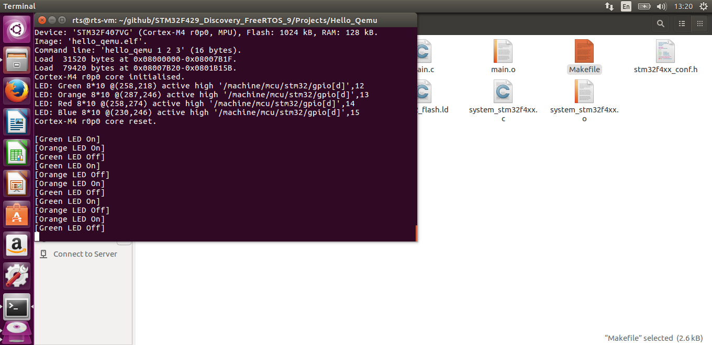

## 1. QEMU安装
  本例程使用qemu-system-gnuarmeclipse，该qemu分支对stm32f4有更好的支持，主要面向Eclipse开发环境，本文档给出在Ubuntu 16.04命令行环境下单独使用的方式。

- 到网页 https://github.com/gnu-mcu-eclipse/qemu/releases/tag/gae-2.7.0-20161128 下载二进制文件到~/work目录：
 gnuarmeclipse-qemu-debian64-2.7.0-201611282115-dev.tgz 
- 在工作目录解压缩文件
```
#cd ~/work
#tar xvf gnuarmeclipse-qemu-debian64-2.7.0-201611282115-dev.tgz
#chmod -R -w ./qemu
```
- 测试qemu能否正常运行
```
#qemu/2.7.0-201611282115-dev/bin/qemu-system-gnuarmeclipse --version
```
如正常则会显示版本信息。

## 2. 编译本例程

- 在Hello_Qemu目录下运行make，生成hello_qemu.elf文件

> 说明：qemu-system-gnuarmeclipse当前版本不支持STM32F4的浮点，对STM32F4F429_Discovery的支持也存在bug，所以例程中的硬件资源对应的是STM32F4_Discovery开发板，MCU为STM32F407VG。相应的，FreeRTOS使用的portable目录也由ARM_CM4F改为ARM_CM3。

## 3. QEMU仿真

- 在Hello_Qemu目录下运行：
```
~/work/qemu/2.7.0-201611282115-dev/bin/qemu-system-gnuarmeclipse --verbose --verbose --board STM32F4-Discovery \
--mcu STM32F407VG -d unimp,guest_errors \
--nographic --image hello_qemu.elf \
--semihosting-config enable=on,target=native \
--semihosting-cmdline hello_qemu 1 2 3
```
> 参数含义参见： https://gnu-mcu-eclipse.github.io/qemu/options/
如正常运行则会显示LED的状态变化。如图所示：



 
 
